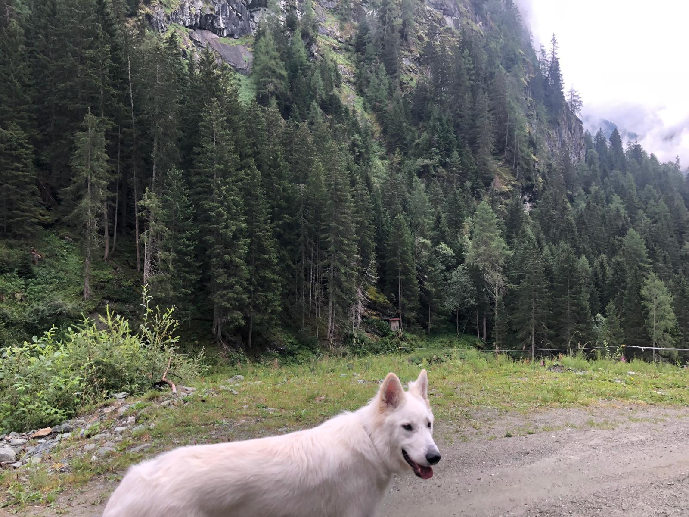
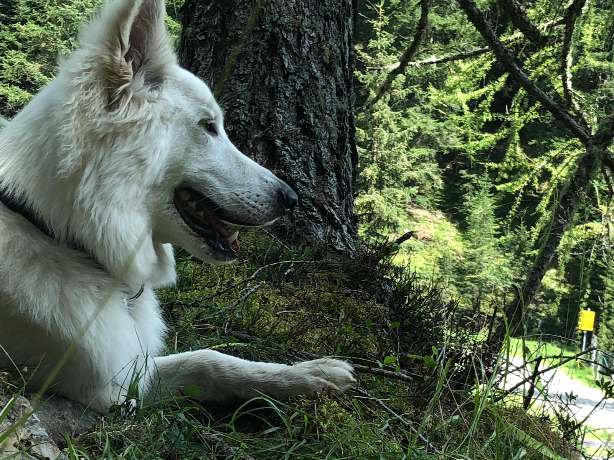

Hey Leute,

Heute stelle ich euch mal meinen Hund vor.
Also mein Hund heißt Rumo (fragt nicht warum er so heißt,
war eine Idee von meinem großen Bruder).
Er ist ein weißer Schäferhund, und sehr groß,
aber was nicht heißt dass er bellt oder aggressiv ist.
Er will am liebsten den ganzen Tag gestreichelt werden,
und ist immer für einen Spaziergang zu haben.
Er ist einfach super!


  

  
  

  

